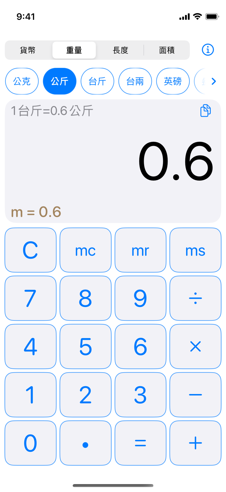
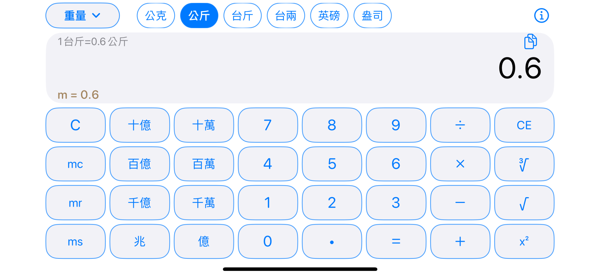
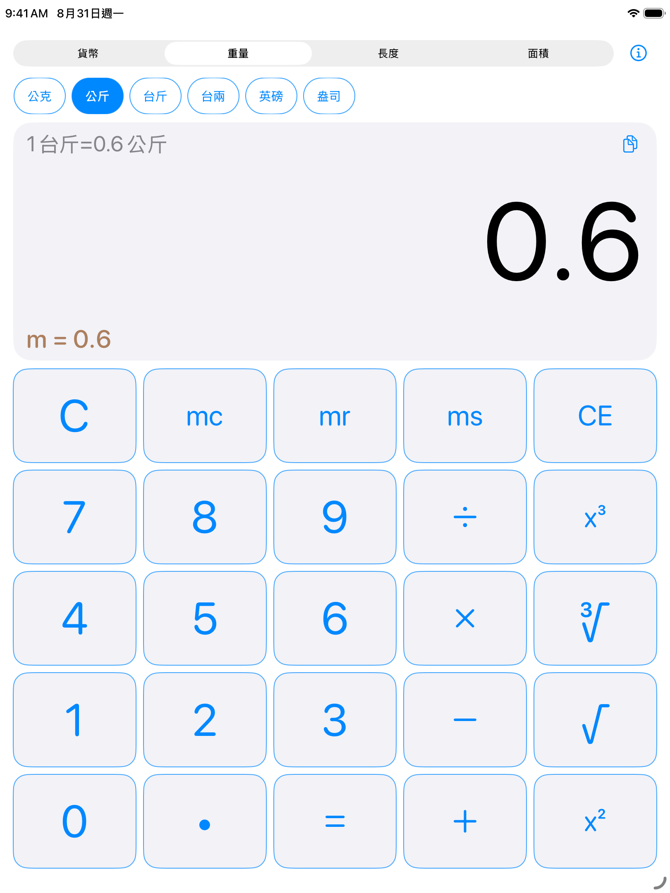
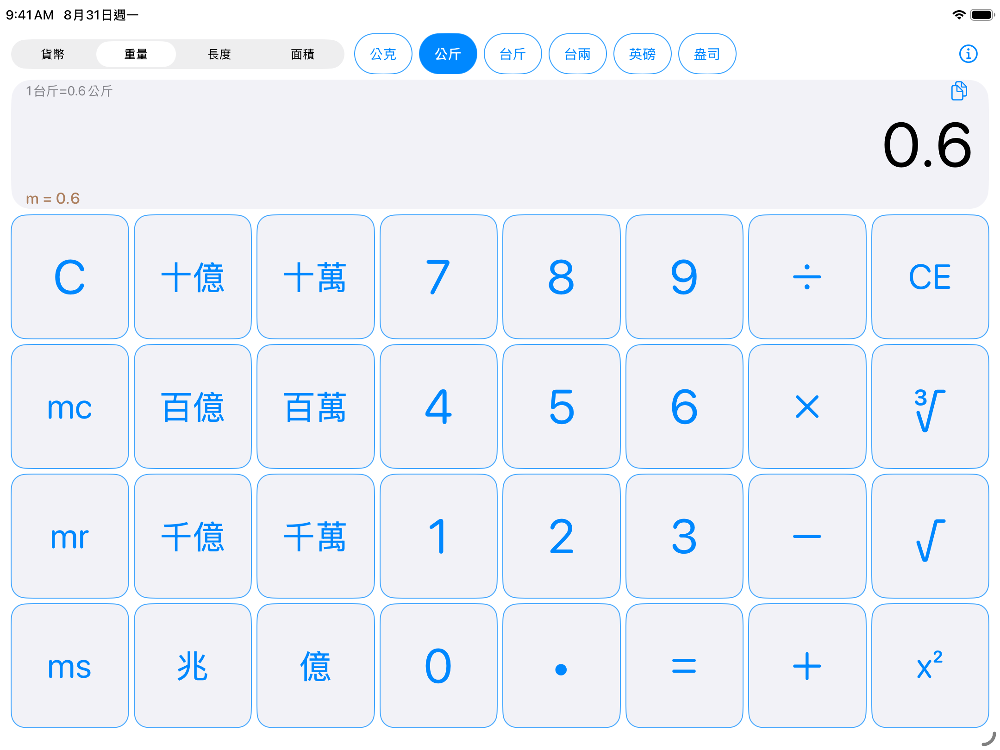

# unitCalc

unitCalc（小確幸度量計算機）是一款適用於 iPhone 與 iPad 的計算及單位換算 App，提供基本運算、記憶功能，以及台灣常用度量單位與貨幣換算。需要 iOS／iPadOS 15 或以上版本。

[App Store](https://apps.apple.com/tw/app/unitcalc/id6445979881) · [隱私權政策](https://peiyu66.github.io/unitCalc/docs/PrivacyPolicy.html)

## 功能

- 支援四則運算、平方、立方、平方根、立方根及記憶功能。
- 提供十萬至兆等大數快捷鍵。
- 單位選項可橫向捲動，並以方向提示標示尚有其他選項。
- 依裝置尺寸與方向調整介面，支援 iPhone 與 iPad 的直向、橫向操作。

## 換算單位

- 重量：公克、公斤、台斤、台兩、英磅、盎司。
- 長度：公尺、公分、台尺、台寸、英尺、英寸。
- 面積：台坪、台畝、台分、台甲、平方公尺、公頃、平方英尺。
- 貨幣：台幣、美元、日圓、歐元、英鎊、韓元、越南盾、港幣、人民幣。

貨幣換算主要採用臺灣銀行對台幣現金賣出匯率；無現金匯率時改用即期賣出匯率。臺灣銀行服務暫時無法使用時，App 會以中央銀行官方資料計算參考匯率，並顯示來源與資料時間。最後一次成功取得的匯率會保存在裝置內，以供離線使用。

匯率資料僅供換算參考，不代表任何金融機構的實際交易報價；實際匯率應以交易時相關金融機構公告為準。unitCalc 為獨立開發工具，與臺灣銀行及中央銀行沒有隸屬、合作、代理或背書關係。中央銀行資料依[政府資料開放授權條款第 1 版](https://data.gov.tw/license)使用。

## 隱私

unitCalc 不需要帳號，也不使用廣告、分析或追蹤服務。App 僅在更新匯率時連線至臺灣銀行或中央銀行；詳細內容請參閱[隱私權政策](https://peiyu66.github.io/unitCalc/docs/PrivacyPolicy.html)。

## 截圖

### iPhone 13 mini

  
  

### iPad（約 10 吋）

  
  

